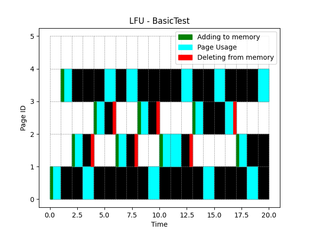

[Back to summary](./readme.md)

# Test BasicTest
## Test description
Basic test with parameters selected to check the correctness of the algorithm implementation (small sample)
## Input data
- Memory size: 3
- Number of unique pages: 4
- Queue: [1, 4, 2, 1, 3, 4, 2, 4, 3, 1, 2, 2, 4, 3, 1, 4, 3, 2, 1, 4]

## Algorithm FIFO
- Number of errors: 7

## Algorithm LFU
- Number of errors: 9

## Algorithm LRU
- Number of errors: 14

## Summary

=== REPLACE THIS WITH SUMMARY ===

