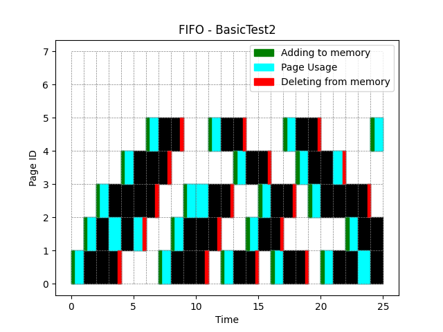
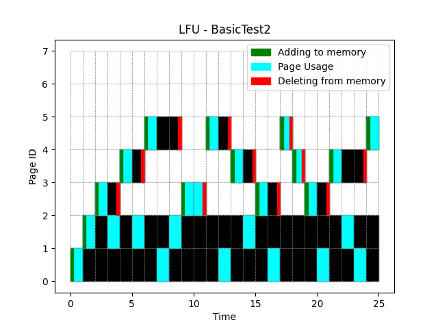
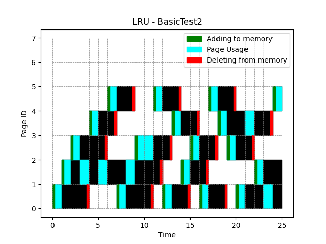

[Back to summary](./readme.md)

# Test BasicTest2
## Test description
Basic test with parameters selected to check the operation of the algorithm (25 elements) - To be compared with manual simulation on paper
## Input data
- Memory size: 3
- Number of unique pages: 5
- Queue: [1, 2, 3, 2, 4, 2, 5, 1, 2, 3, 3, 5, 1, 4, 2, 3, 1, 5, 4, 3, 1, 4, 2, 1, 5]

## Algorithm FIFO
- Number of errors: 20

## Algorithm LFU
- Number of errors: 14

## Algorithm LRU
- Number of errors: 19

## Summary

=== REPLACE THIS WITH SUMMARY ===

