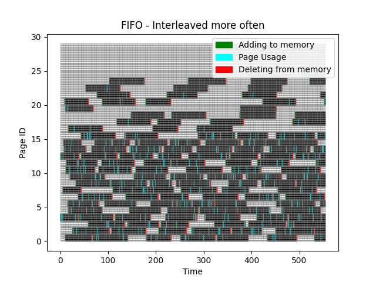
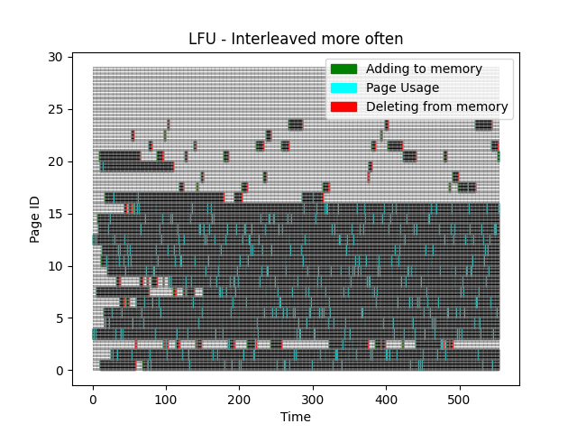
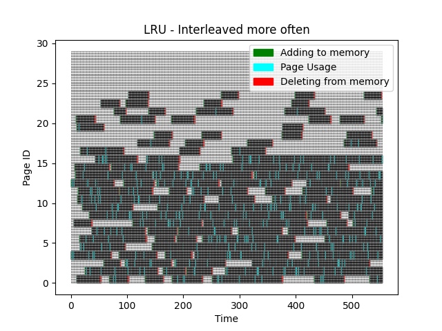

[Back to summary](./readme.md)

# Test Interleaved more often
## Test description
A queue of 512 processes dominated by processes from the range [1, 16]. 42 (i.e. 512//12) processes from the range [17, 24] were randomly inserted into this queue [Memory size: 16, Unique pages: 24, Queue length: 554]
## Input data
- Memory size: 16
- Number of unique pages: 24
- Queue: [4, 13, 4, 13, 4, 8, 13, 15, 14, 21, 1, 20, 11, 12, 20, 6, 5, 17, 5, 11, 10, 11, 14, 5, 15, 2, 6, 13, 2, 17, 13, 4, 11, 9, 2, 12, 11, 7, 12, 4, 6, 4, 11, 16, 13, 10, 7, 12, 13, 11, 16, 12, 11, 23, 2, 5, 16, 16, 3, 7, 7, 16, 17, 16, 5, 9, 14, 6, 1, 5, 5, 7, 15, 10, 9, 1, 1, 22, 2, 1, 11, 9, 7, 10, 10, 4, 16, 12, 21, 11, 7, 7, 14, 6, 13, 15, 9, 3, 23, 3, 3, 2, 24, 12, 9, 9, 15, 2, 9, 15, 8, 12, 11, 3, 3, 4, 14, 13, 18, 12, 11, 11, 2, 9, 8, 13, 21, 9, 8, 8, 4, 2, 1, 15, 16, 9, 16, 7, 22, 16, 11, 3, 18, 3, 5, 14, 14, 14, 19, 6, 7, 8, 14, 13, 10, 13, 15, 16, 11, 14, 9, 10, 16, 15, 2, 15, 16, 13, 4, 9, 2, 10, 11, 8, 8, 12, 8, 5, 4, 21, 1, 13, 8, 8, 14, 3, 3, 9, 8, 6, 1, 7, 9, 17, 9, 8, 14, 10, 9, 5, 1, 11, 1, 18, 13, 13, 2, 14, 14, 10, 7, 3, 11, 13, 13, 12, 12, 14, 12, 2, 4, 2, 3, 22, 5, 7, 4, 13, 9, 15, 10, 12, 12, 19, 6, 14, 8, 23, 10, 10, 15, 15, 9, 3, 12, 6, 15, 4, 15, 9, 6, 1, 9, 8, 14, 7, 7, 22, 5, 14, 6, 1, 1, 11, 10, 6, 15, 24, 13, 1, 12, 15, 8, 6, 9, 2, 6, 2, 4, 2, 9, 5, 4, 4, 12, 14, 17, 11, 16, 13, 13, 8, 5, 10, 8, 13, 6, 6, 7, 1, 17, 5, 4, 4, 15, 16, 8, 9, 10, 6, 2, 6, 9, 6, 18, 6, 16, 2, 8, 16, 16, 5, 3, 7, 6, 10, 14, 1, 16, 5, 14, 2, 2, 15, 2, 16, 13, 13, 8, 10, 1, 3, 8, 4, 3, 5, 12, 13, 8, 2, 10, 4, 9, 14, 3, 10, 13, 10, 11, 2, 16, 16, 10, 11, 14, 3, 10, 6, 6, 14, 16, 5, 15, 11, 9, 19, 20, 9, 9, 2, 22, 8, 2, 15, 8, 3, 7, 11, 8, 10, 11, 10, 7, 23, 3, 15, 5, 5, 16, 24, 2, 2, 22, 2, 14, 2, 15, 11, 10, 16, 5, 4, 12, 16, 11, 2, 7, 11, 12, 13, 14, 9, 3, 21, 13, 4, 13, 9, 15, 10, 16, 10, 7, 1, 10, 5, 7, 5, 14, 4, 10, 3, 14, 7, 1, 7, 13, 1, 9, 1, 2, 16, 6, 4, 12, 8, 7, 10, 15, 15, 6, 16, 11, 5, 12, 5, 4, 16, 5, 16, 2, 7, 14, 11, 10, 3, 3, 3, 4, 21, 13, 2, 3, 5, 6, 6, 18, 3, 14, 10, 16, 19, 13, 14, 9, 10, 6, 4, 18, 4, 16, 6, 8, 4, 9, 8, 8, 6, 13, 10, 13, 10, 18, 16, 14, 10, 13, 10, 11, 13, 5, 7, 24, 7, 7, 2, 5, 8, 5, 4, 14, 1, 2, 13, 11, 12, 9, 16, 16, 12, 10, 13, 7, 6, 22, 1, 4, 14, 14, 14, 14, 6, 21, 16]

## Algorithm FIFO
- Number of errors: 136

## Algorithm LFU
- Number of errors: 83

## Algorithm LRU
- Number of errors: 100

## Summary

=== REPLACE THIS WITH SUMMARY ===

