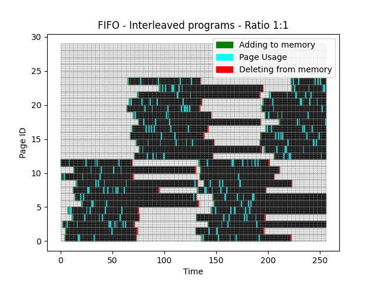
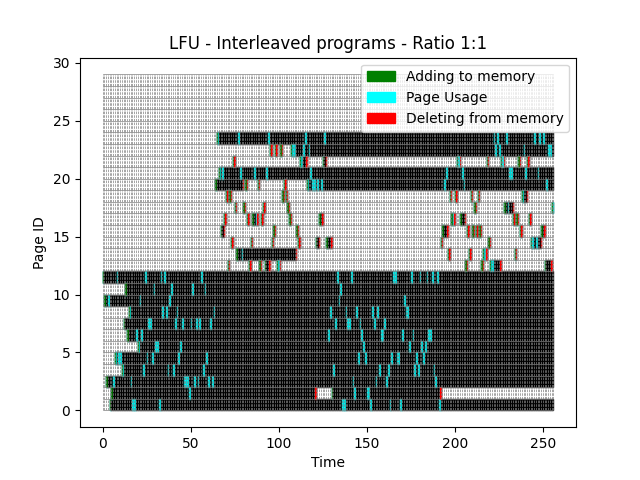
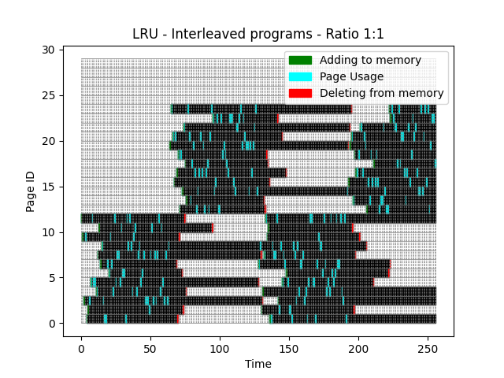

[Back to summary](./readme.md)

# Test Interleaved programs - Ratio 1:1
## Test description
Programs running simultaneously in rotation with 12 unique pages each, queue of 64 processes per program cycle (A single program cannot fill the entire memory 12/16) [Memory size: 16, Unique pages: 24, Queue length: 256]
## Input data
- Memory size: 16
- Number of unique pages: 24
- Queue: [12, 10, 3, 10, 1, 2, 3, 5, 12, 5, 5, 4, 8, 11, 7, 9, 3, 1, 1, 7, 6, 10, 7, 4, 12, 5, 8, 8, 5, 11, 6, 6, 1, 12, 9, 12, 9, 4, 10, 11, 4, 8, 9, 5, 6, 8, 3, 3, 3, 2, 8, 11, 3, 8, 3, 8, 12, 4, 11, 5, 3, 8, 3, 9, 20, 24, 21, 16, 21, 17, 19, 13, 19, 15, 22, 18, 14, 24, 21, 14, 18, 20, 17, 13, 15, 17, 21, 17, 20, 13, 17, 18, 13, 21, 24, 23, 15, 16, 23, 13, 13, 23, 19, 20, 19, 18, 17, 23, 23, 23, 16, 15, 22, 22, 23, 24, 20, 23, 21, 20, 20, 15, 20, 17, 20, 22, 24, 15, 7, 9, 2, 4, 8, 12, 10, 11, 1, 1, 9, 8, 8, 12, 3, 2, 9, 5, 8, 7, 6, 5, 2, 2, 1, 9, 8, 3, 9, 4, 7, 7, 8, 3, 4, 1, 5, 12, 12, 5, 5, 1, 7, 10, 9, 9, 6, 12, 7, 4, 5, 4, 12, 6, 5, 6, 12, 7, 7, 12, 4, 3, 12, 1, 15, 16, 20, 21, 14, 19, 17, 17, 19, 22, 22, 17, 21, 20, 13, 16, 14, 19, 16, 18, 16, 19, 16, 13, 14, 14, 22, 15, 13, 13, 24, 23, 24, 23, 22, 22, 18, 24, 18, 21, 21, 17, 14, 17, 22, 16, 19, 23, 21, 22, 17, 15, 15, 24, 15, 21, 24, 16, 24, 13, 20, 23, 23, 18]

## Algorithm FIFO
- Number of errors: 48

## Algorithm LFU
- Number of errors: 92

## Algorithm LRU
- Number of errors: 46

## Summary

=== REPLACE THIS WITH SUMMARY ===

