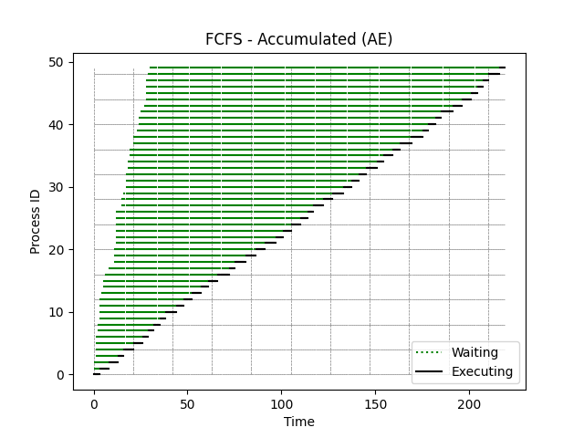
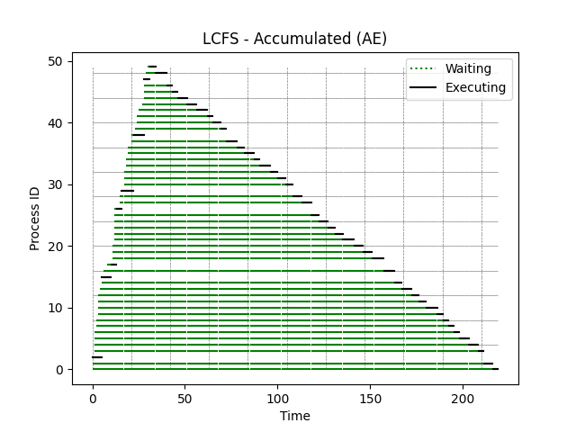
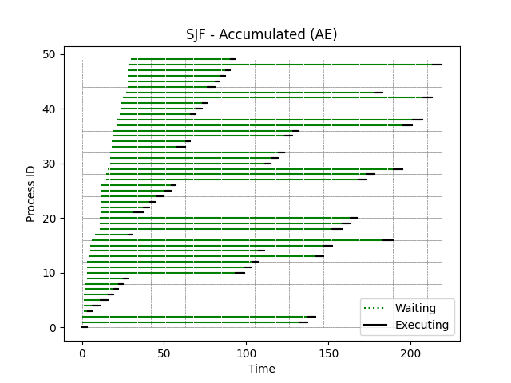

[Back to summary](./readme.md)

# Test Accumulated (AE)
## Test description
A test containing cumulative processes with similar arrival and execution times
## Input data
- Number of processes: 50
- Arrival time min-max: (0, 30)
- Duration time min-max: (3, 6)

## Algorithm FCFS
- Process waiting times: [0, 3, 8, 12, 15, 20, 25, 27, 30, 32, 35, 41, 45, 48, 52, 56, 60, 64, 64, 70, 75, 79, 85, 89, 93, 98, 102, 102, 107, 111, 116, 120, 124, 127, 133, 135, 140, 142, 148, 152, 154, 158, 160, 164, 168, 173, 176, 179, 181, 186]
- Average waiting time: 93.68

## Algorithm LCFS
- Process waiting times: [216, 211, 0, 207, 202, 197, 194, 190, 187, 183, 177, 173, 169, 163, 158, 0, 151, 2, 140, 135, 130, 123, 119, 115, 110, 106, 1, 98, 93, 0, 87, 83, 79, 72, 69, 63, 59, 51, 1, 46, 41, 38, 31, 24, 18, 15, 12, 0, 5, 1]
- Average waiting time: 94.9

## Algorithm SJF
- Process waiting times: [0, 132, 137, 2, 5, 10, 15, 17, 20, 22, 90, 96, 100, 138, 102, 142, 177, 20, 141, 147, 152, 19, 25, 29, 33, 38, 42, 153, 158, 173, 94, 98, 102, 39, 45, 104, 109, 174, 180, 43, 45, 49, 182, 151, 48, 53, 56, 59, 184, 60]
- Average waiting time: 84.2

## Summary

Best algorithms in terms of lowest _average waiting time_: 
1. **SJF**
2. FCFS
3. LCFS

