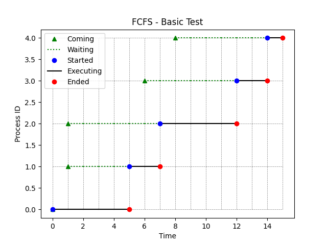
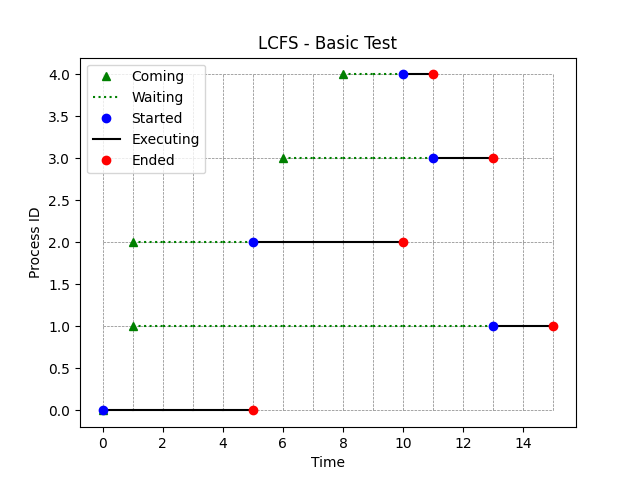
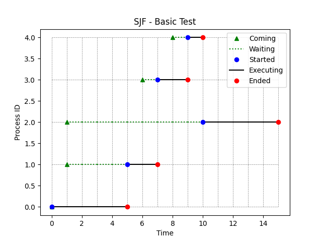

[Back to summary](./readme.md)

# Test Basic Test
## Test description
Basic test with parameters selected to check the correctness of the algorithm implementation (small sample)
## Input data
- Number of processes: 5
- Arrival time min-max: (0, 8)
- Duration time min-max: (1, 5)

## Algorithm FCFS
- Process waiting times: [0, 4, 6, 6, 6]
- Average waiting time: 4.4

## Algorithm LCFS
- Process waiting times: [0, 12, 4, 5, 2]
- Average waiting time: 4.6

## Algorithm SJF
- Process waiting times: [0, 4, 9, 1, 1]
- Average waiting time: 3.0

## Summary

Best algorithms in terms of lowest _average waiting time_: 
1. **SJF**
2. FCFS
3. LCFS

