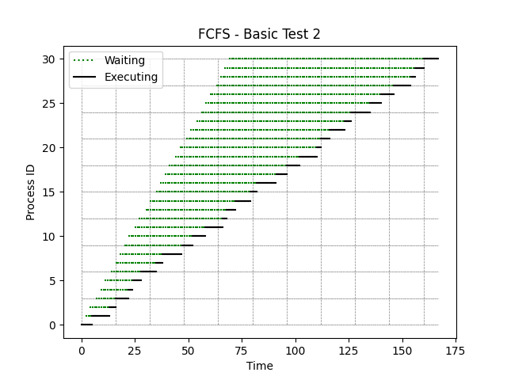
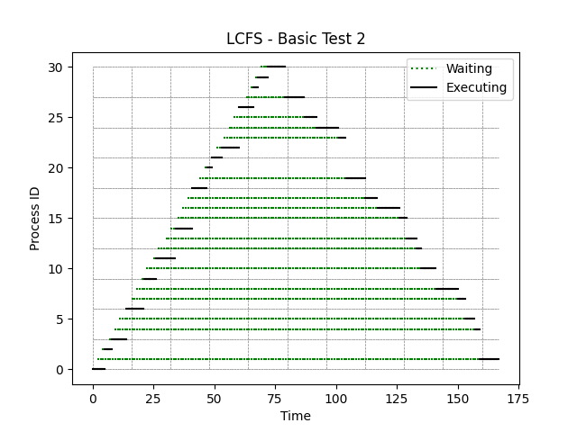
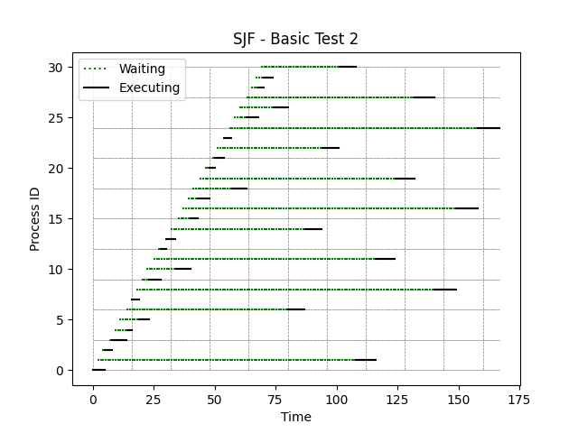

[Back to summary](./readme.md)

# Test Basic Test 2
## Test description
Basic test on a larger sample
## Input data
- Number of processes: 31
- Arrival time min-max: (0, 69)
- Duration time min-max: (2, 9)

## Algorithm FCFS
- Process waiting times: [0, 3, 9, 9, 13, 13, 14, 19, 20, 27, 30, 33, 39, 38, 40, 44, 45, 52, 55, 58, 64, 63, 65, 69, 70, 77, 80, 83, 89, 89, 91]
- Average waiting time: 45.193548387096776

## Algorithm LCFS
- Process waiting times: [0, 157, 1, 1, 148, 142, 0, 134, 123, 1, 113, 1, 106, 99, 2, 91, 80, 73, 0, 60, 1, 0, 2, 47, 36, 29, 0, 16, 1, 1, 3]
- Average waiting time: 47.354838709677416

## Algorithm SJF
- Process waiting times: [0, 106, 1, 1, 5, 8, 66, 0, 122, 3, 12, 91, 1, 0, 55, 5, 112, 4, 16, 80, 2, 1, 43, 0, 102, 5, 14, 69, 3, 3, 32]
- Average waiting time: 31.032258064516128

## Summary

=== REPLACE THIS WITH SUMMARY ===

