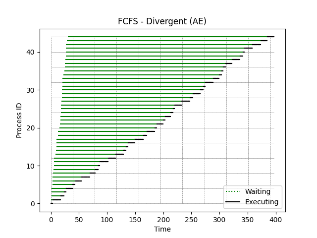
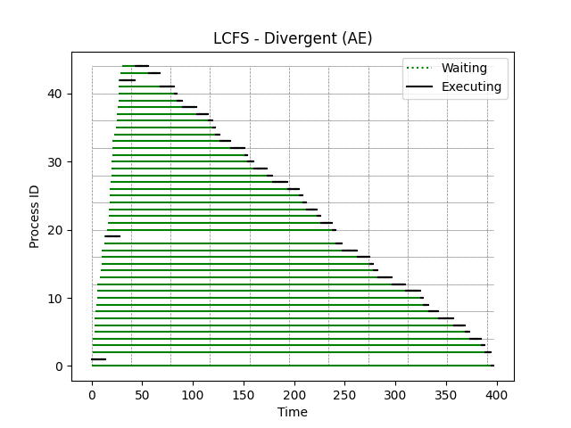
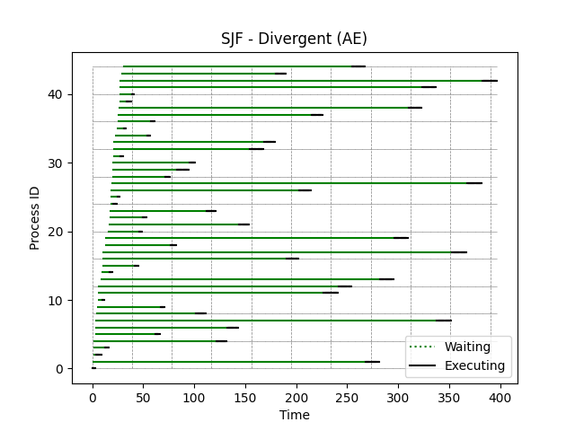

[Back to summary](./readme.md)

# Test Divergent (AE)
## Test description
A test containing different processes with similar arrival and execution times
## Input data
- Number of processes: 45
- Arrival time min-max: (0, 30)
- Duration time min-max: (3, 15)

## Algorithm FCFS
- Process waiting times: [0, 3, 16, 22, 26, 35, 40, 51, 65, 74, 78, 81, 96, 107, 120, 123, 127, 139, 151, 157, 169, 172, 182, 186, 195, 199, 202, 213, 227, 232, 245, 250, 253, 267, 277, 279, 281, 285, 296, 309, 314, 317, 331, 344, 354]
- Average waiting time: 175.33333333333334

## Algorithm LCFS
- Process waiting times: [394, 0, 387, 383, 372, 365, 354, 339, 328, 322, 318, 303, 290, 274, 269, 264, 252, 237, 228, 1, 222, 210, 205, 195, 190, 187, 175, 159, 153, 140, 134, 130, 116, 105, 100, 95, 90, 78, 63, 57, 54, 40, 1, 27, 13]
- Average waiting time: 191.53333333333333

## Algorithm SJF
- Process waiting times: [0, 267, 2, 11, 120, 58, 129, 334, 97, 61, 3, 220, 235, 273, 7, 31, 180, 342, 63, 282, 30, 127, 32, 94, 2, 6, 184, 348, 51, 62, 75, 6, 133, 147, 31, 6, 32, 189, 283, 6, 11, 296, 355, 150, 224]
- Average waiting time: 124.33333333333333

## Summary

Best algorithms in terms of lowest _average waiting time_: 
1. **SJF**
2. FCFS
3. LCFS

