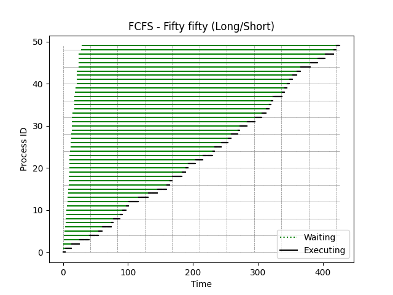
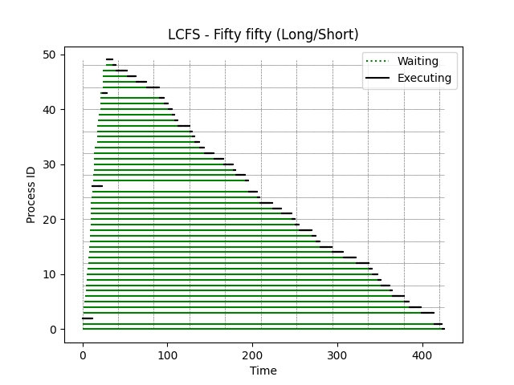
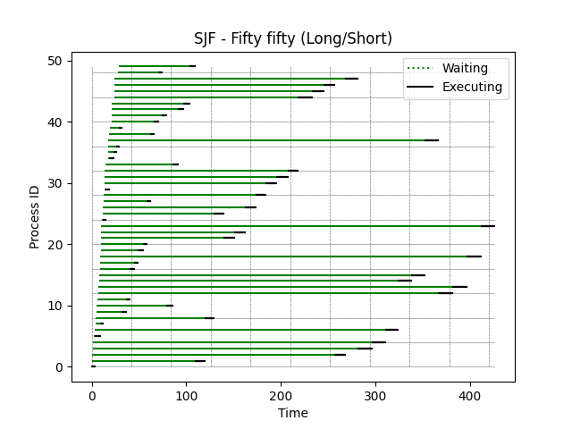

[Back to summary](./readme.md)

# Test Fifty fifty (Long/Short)
## Test description
Fifty fifty test - long and short processes
## Input data
- Number of processes: 50
- Arrival time min-max: (0, 29)
- Duration time min-max: (3, 15)

## Algorithm FCFS
- Process waiting times: [0, 3, 13, 24, 39, 52, 57, 70, 73, 82, 86, 91, 94, 109, 123, 137, 150, 155, 159, 173, 178, 182, 194, 205, 219, 221, 231, 241, 245, 255, 258, 269, 281, 291, 295, 300, 303, 306, 319, 322, 323, 327, 332, 338, 341, 356, 368, 379, 388, 391]
- Average waiting time: 206.96

## Algorithm LCFS
- Process waiting times: [423, 413, 0, 397, 383, 376, 361, 357, 347, 342, 336, 331, 315, 300, 285, 271, 265, 261, 246, 240, 236, 224, 213, 198, 194, 183, 0, 178, 167, 163, 152, 140, 129, 122, 115, 112, 109, 95, 90, 86, 80, 75, 69, 2, 51, 39, 28, 15, 7, 0]
- Average waiting time: 190.42

## Algorithm SJF
- Process waiting times: [0, 109, 256, 280, 295, 1, 307, 5, 115, 27, 74, 30, 359, 374, 316, 330, 31, 36, 387, 39, 44, 129, 141, 401, 1, 117, 150, 45, 160, 1, 170, 181, 193, 70, 1, 6, 9, 335, 44, 10, 45, 53, 70, 76, 194, 209, 221, 244, 42, 74]
- Average waiting time: 136.14

## Summary

=== REPLACE THIS WITH SUMMARY ===

