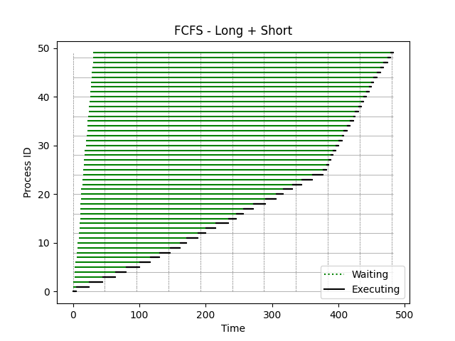
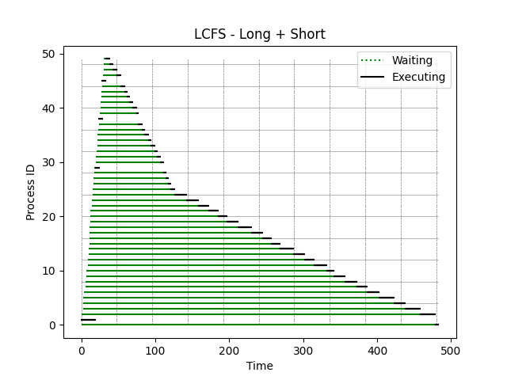
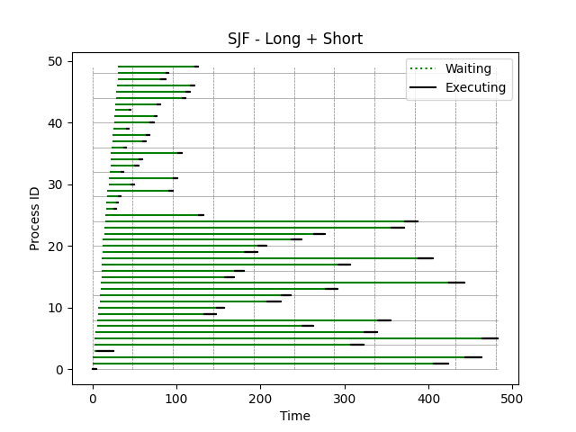

[Back to summary](./readme.md)

# Test Long + Short
## Test description
A test containing first long processes, then short ones
## Input data
- Number of processes: 50
- Arrival time min-max: (0, 30)
- Duration time min-max: (3, 20)

## Algorithm FCFS
- Process waiting times: [0, 5, 23, 41, 61, 77, 96, 110, 124, 139, 154, 162, 179, 190, 205, 223, 235, 246, 261, 278, 294, 305, 316, 330, 345, 360, 365, 368, 370, 373, 376, 380, 384, 386, 391, 395, 399, 401, 406, 409, 411, 416, 419, 422, 425, 430, 434, 438, 444, 448]
- Average waiting time: 288.98

## Algorithm LCFS
- Process waiting times: [478, 0, 457, 435, 419, 399, 382, 366, 350, 334, 324, 305, 293, 277, 258, 245, 234, 219, 201, 184, 173, 160, 144, 128, 111, 104, 100, 97, 93, 1, 87, 82, 78, 72, 68, 63, 59, 53, 0, 49, 43, 39, 35, 31, 25, 0, 19, 12, 8, 3]
- Average waiting time: 161.94

## Algorithm SJF
- Process waiting times: [0, 405, 442, 2, 304, 460, 319, 243, 333, 125, 140, 198, 215, 267, 414, 146, 158, 281, 376, 168, 184, 224, 249, 341, 356, 110, 8, 11, 13, 73, 26, 76, 13, 28, 33, 79, 14, 35, 40, 15, 42, 47, 16, 50, 78, 83, 87, 51, 57, 91]
- Average waiting time: 150.52

## Summary

Best algorithms in terms of lowest _average waiting time_: 
1. **SJF**
2. LCFS
3. FCFS

