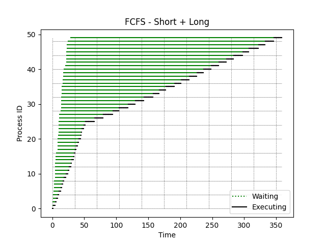

[Back to summary](./readme.md)

# Test Short + Long
## Test description
A test containing first short, then long processes
## Input data
- Number of processes: 50
- Arrival time min-max: (0, 28)
- Duration time min-max: (1, 15)

## Algorithm FCFS
- Process waiting times: [0, 1, 4, 5, 7, 8, 10, 12, 13, 14, 17, 20, 22, 25, 25, 28, 28, 27, 29, 31, 33, 35, 35, 36, 39, 41, 55, 68, 81, 90, 104, 115, 129, 142, 152, 162, 175, 185, 197, 209, 218, 228, 238, 250, 261, 275, 284, 299, 308, 318]
- Average waiting time: 101.76

## Algorithm LCFS
- Process waiting times: [358, 355, 0, 352, 350, 0, 346, 345, 343, 339, 336, 334, 331, 330, 2, 0, 0, 324, 322, 320, 317, 315, 313, 310, 308, 0, 294, 279, 267, 252, 241, 227, 213, 202, 192, 178, 167, 154, 141, 131, 118, 104, 90, 79, 65, 55, 39, 29, 1, 11]
- Average waiting time: 203.58

## Algorithm SJF
- Process waiting times: [0, 1, 26, 27, 29, 43, 1, 3, 29, 3, 6, 9, 11, 14, 14, 17, 17, 26, 28, 30, 40, 15, 15, 30, 33, 319, 223, 333, 38, 171, 185, 259, 273, 46, 56, 286, 65, 231, 74, 86, 192, 202, 91, 103, 114, 128, 137, 152, 291, 232]
- Average waiting time: 95.08

## Summary

Best algorithms in terms of lowest _average waiting time_: 
1. **SJF**
2. FCFS
3. LCFS

